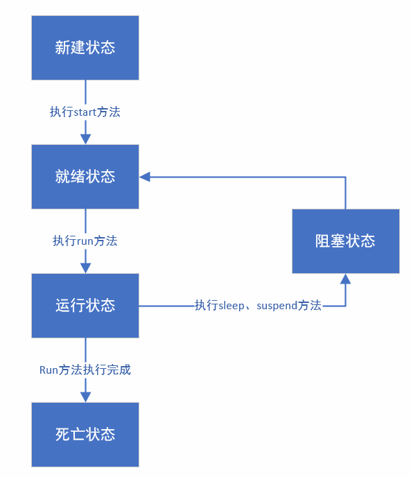

# Java

## 1. 线程

### 1.1 线程的生命周期



### 1.2 线程的状态

- **新建状态:**

  使用 **new** 关键字和 **Thread** 类或其子类建立一个线程对象后，该线程对象就处于新建状态。它保持这个状态直到程序 **start()** 这个线程。

- **就绪状态:**

  当线程对象调用了start()方法之后，该线程就进入就绪状态。就绪状态的线程处于就绪队列中，要等待JVM里线程调度器的调度。

- **运行状态:**

  如果就绪状态的线程获取 CPU 资源，就可以执行 **run()**，此时线程便处于运行状态。处于运行状态的线程最为复杂，它可以变为阻塞状态、就绪状态和死亡状态。

- **阻塞状态:**

  如果一个线程执行了sleep（睡眠）、suspend（挂起）等方法，失去所占用资源之后，该线程就从运行状态进入阻塞状态。在睡眠时间已到或获得设备资源后可以重新进入就绪状态。可以分为三种：

  - 等待阻塞：运行状态中的线程执行 wait() 方法，使线程进入到等待阻塞状态。
  - 同步阻塞：线程在获取 synchronized 同步锁失败(因为同步锁被其他线程占用)。
  - 其他阻塞：通过调用线程的 sleep() 或 join() 发出了 I/O 请求时，线程就会进入到阻塞状态。当sleep() 状态超时，join() 等待线程终止或超时，或者 I/O 处理完毕，线程重新转入就绪状态。

- **死亡状态:**

  一个运行状态的线程完成任务或者其他终止条件发生时，该线程就切换到终止状态。

### 1.3 创建线程的方法

1. 通过Runnable接口实现
2. 通过继承Thead类本身
3. 通过Callable和Future创建线程

### 1.4 通过Runnable接口创建线程

Runnable接口只有run()一个需要重写的方法

**使用方法**

```java
public class RunnableThread implements Runnable{
    private String TheadName;
    private Thread thread;

    public RunnableThread(String theadName) {
        TheadName = theadName;
    }

    public void run() {
        System.out.println("线程："+TheadName+"开始执行run方法");
        for(int i=0;i<5;i++){
            System.out.println("线程："+TheadName+"的run方法执行到第"+i+"轮");
            int j = 2000;
            while(j>0){
                j--;
            }
        }
    }

    public void start(){
        System.out.println("线程："+TheadName+"开始执行start方法");
        if(thread == null)
            thread = new Thread(this,TheadName);
            thread.start();
    }
}
```

这里使用Thead的一个构造函数来实例化一个Thead对象

```java
public Thread(Runnable target, String name) {
    init(null, target, name, 0);
}
```

第一个参数是一个runnable对象，第二个参数为线程名

在调用start方法后，run方法自动开始执行

### 1.5 继承Thead来创建线程

```java
public class RunnableThread implements Runnable{
    private String TheadName;
    private Thread thread;

    public RunnableThread(String theadName) {
        TheadName = theadName;
    }

    public void run() {
        System.out.println("线程："+TheadName+"开始执行run方法");
        for(int i=0;i<5;i++){
            System.out.println("线程："+TheadName+"的run方法执行到第"+i+"轮");
            int j = 2000;
            while(j>0){
                j--;
            }
        }
    }

    public void start(){
        System.out.println("线程："+TheadName+"开始执行start方法");
        if(thread == null)
            thread = new Thread(this,TheadName);
            thread.start();
    }
}
```

实际上也是通过实例化一个runnable对象来实现

### 1.6 通过Callable 和 Future 创建线程

```java
public class CallableThreadTest implements Callable<Integer> {
    public static void main(String[] args)  
    {  
        CallableThreadTest ctt = new CallableThreadTest();  
        FutureTask<Integer> ft = new FutureTask<>(ctt);  
        for(int i = 0;i < 100;i++)  
        {  
            System.out.println(Thread.currentThread().getName()+" 的循环变量i的值"+i);  
            if(i==20)  
            {  
                new Thread(ft,"有返回值的线程").start();  
            }  
        }  
       
        System.out.println("子线程的返回值："+ft.get());  
    }
    @Override  
    public Integer call() throws Exception  
    {  
        int i = 0;  
        for(;i<100;i++)  
        {  
            System.out.println(Thread.currentThread().getName()+" "+i);  
        }  
        return i;  
    }  
}
```

call方法相当于run方法

## 2. 流stream

### 2.1 利用stream进行排序

| 方法                         | 使用                                           |
| ---------------------------- | ---------------------------------------------- |
| list.stream()                | 将list转换为stream                             |
| .sorted()                    | 对stream进行排序                               |
| Comparator.comparingInt()    | 比较器，通过对象的get方法进行比较，默认是升序  |
| .reversed()                  | 将该方法前的stream进行反向排序，即升序变为降序 |
| thenComparingInt()           | 如果之前比较的属性相等，则再比较，默认是升序   |
| collect(Collectors.toList()) | 将stream转换为list                             |
| .map()                       | 只提取排序对象的一个属性，通过get获得          |

**使用例子：**

```java
student student1 = new student(1,91);
        student student2 = new student(1,90);
        student student3 = new student(2,89);
        List<student> list = new ArrayList<>();
        list.add(student1);
        list.add(student2);
        list.add(student3);
        list = list.stream()
        .sorted(Comparator.comparingInt(student::getAge).thenComparingInt(student::getScore).reversed())
                .collect(Collectors.toList());
```

如果需要按多个属性降序排列，reversed应该放最后。

reversed是对排序后的list做倒排，并不是对排序顺序做一个规定