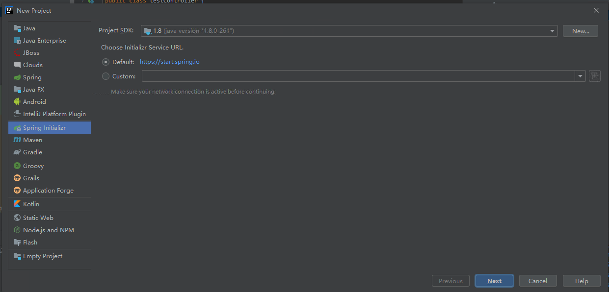
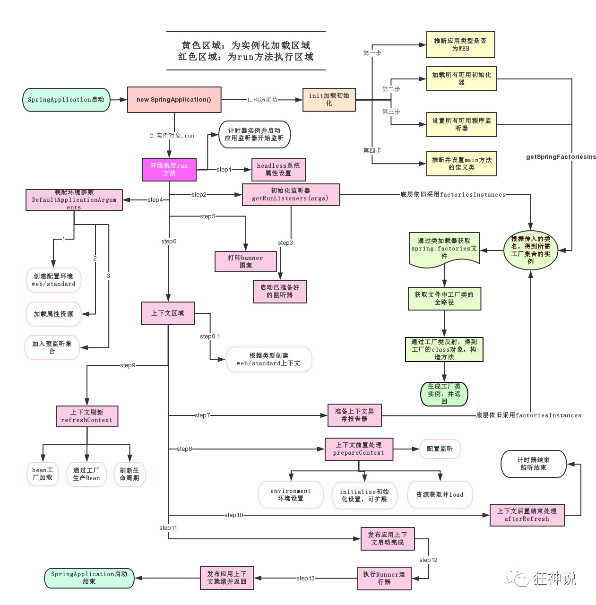

# Spring boot

## 1. Spring boot项目创建



## 2. spring boot的运行机制



### 2.1 管理依赖版本的地方

```xml
<parent>
    <groupId>org.springframework.boot</groupId>
    <artifactId>spring-boot-starter-parent</artifactId>
    <version>2.4.2</version>
    <relativePath/> <!-- lookup parent from repository -->
</parent>
```

有了这个父依赖，以后**导入依赖默认是不需要写版本**；但是如果导入的包没有在依赖中管理就需要重新配置版本了。

### 2.2 启动器

```xml
<dependency>
    <groupId>org.springframework.boot</groupId>
    <artifactId>spring-boot-starter-web</artifactId>
</dependency>
```

**spring-boot-starter-xxx**：是spring-boot的场景启动器

**spring-boot-starter-web**：帮我们导入了web模块正常运行所依赖的组件；

SpringBoot将所有的功能场景都抽取出来，做成一个个的starter （启动器），只需要在项目中引入这些starter即可，所有相关的依赖都会导入进来 ， 我们要用什么功能就导入什么样的场景启动器即可 ；我们未来也可以自己自定义 starter；

### 2.3 主启动器

#### 2.3.1 spring boot的主启动类

```java
@SpringBootApplication
public class SpringBoot01Application {
    public static void main(String[] args) {
        SpringApplication.run(SpringBoot01Application.class, args);
    }
}
```

#### 2.3.2 @SpringBootApplication

申明某类是spring-boot的主配置类，会运行该类的main方法来启动spring-boot项目

```java
@SpringBootConfiguration
@EnableAutoConfiguration
@ComponentScan(
    excludeFilters = {@Filter(
    type = FilterType.CUSTOM,
    classes = {TypeExcludeFilter.class}
), @Filter(
    type = FilterType.CUSTOM,
    classes = {AutoConfigurationExcludeFilter.class}
)}
)
public @interface SpringBootApplication {
    // ......
}
```

#### 2.3.3 @ComponentScan

自动扫描并加载符合条件的组件或者bean，然后装载到IOC容器中

#### 2.3.4 @SpringBootConfiguration

```java
// 点进去得到下面的 @Component
@Configuration
public @interface SpringBootConfiguration {}

@Component
public @interface Configuration {}
```

@Configuration，说明这是一个配置类 ，配置类就是对应Spring的xml 配置文件；

@Component 这就说明，启动类本身也是Spring中的一个组件而已，负责启动应用！

#### 2.3.5 @EnableAutoConfiguration

以前我们需要自己配置的东西，而现在SpringBoot可以自动帮我们配置 ；@EnableAutoConfiguration告诉SpringBoot开启自动配置功能，这样自动配置才能生效；

#### 2.3.6 AutoConfigurationPackage

```java
@Import({Registrar.class})
public @interface AutoConfigurationPackage {
}
```

**@import** ：Spring底层注解@import ， 给容器中导入一个组件

**Registrar.class** ：将主启动类的所在包及包下面所有子包里面的所有组件扫描到Spring容器 ；

## 3. Spring boot注入方式

spring boot注入有三种方法：

1. 通过注解注入
2. 通过配置yml文件注入属性
3. 通过占位符和properties文件注入属性

### 3.1 通过注解注入

```java
@Component
public class Dog {
    
    @Value("小狗比")
    private String name;
    
    @Value("1")
    private Integer age;
}
```

通过@Value指定属性值，不需要构造器和setter方法

@Component指定该类为spring的一个组件，才能被spring boot管理

### 3.2 通过yml文件注入属性

YAML是 "YAML Ain't a Markup Language" （YAML不是一种标记语言）的递归缩写。在开发的这种语言时，YAML 的意思其实是："Yet Another Markup Language"（仍是一种标记语言）

```java
@Component
@ConfigurationProperties(prefix = "person")
public class Person {
    private String name;
    private Integer age;
    private Boolean happy;
    private Date birth;
    private Map<String,Object> maps;
    private List<Object> lists;
    private Dog dog;
    //setter方法
}
```

**@ConfigurationProperties**：指定yml中对应的配置名

```yml
person:
  name: ljq
  age: 18
  happy: false
  birth: 1998/03/02
  maps: {k1: v1,k2: v2}
  lists:
    code
    boy
    music
  dog:
    name: 狗
    age: 1
```

### 3.3 通过占位符和properties注入属性

```java
@Component
@PropertySource(value = "classpath:person.properties")
public class Person {
    @Value("${name}")
    private String name;
    private Integer age;
    private Boolean happy;
    private Date birth;
    private Map<String,Object> maps;
    private List<Object> lists;
    private Dog dog;
    //setter方法
}
```

该方法将属性值写在properties文件里，通过占位符注入。

**@PropertySource**: 指定了对应的properties文件

```properties
name=卢嘉祺
```

**properties**语法：key=data

## 4. 数据校验与多环境切换

### 4.1 数据校验

spring boot中可以使用@validated来校验数据，如果数据异常会统一抛出异常，在spring boot 2.3以后，validated需要手动导入

```xml
<dependency>
    <groupId>org.hibernate.validator</groupId>
    <artifactId>hibernate-validator</artifactId>
    <scope>compile</scope>
</dependency>
```

常用参数

```java
@NotNull(message="名字不能为空")
private String userName;
@Max(value=120,message="年龄最大不能查过120")
private int age;
@Email(message="邮箱格式错误")
private String email;

空检查
@Null       验证对象是否为null
@NotNull    验证对象是否不为null, 无法查检长度为0的字符串
@NotBlank   检查约束字符串是不是Null还有被Trim的长度是否大于0,只对字符串,且会去掉前后空格.
@NotEmpty   检查约束元素是否为NULL或者是EMPTY.
    
Booelan检查
@AssertTrue     验证 Boolean 对象是否为 true  
@AssertFalse    验证 Boolean 对象是否为 false  
    
长度检查
@Size(min=, max=) 验证对象（Array,Collection,Map,String）长度是否在给定的范围之内  
@Length(min=, max=) string is between min and max included.

日期检查
@Past       验证 Date 和 Calendar 对象是否在当前时间之前  
@Future     验证 Date 和 Calendar 对象是否在当前时间之后  
@Pattern    验证 String 对象是否符合正则表达式的规则

.......等等
除此以外，我们还可以自定义一些数据校验规则
```


### 4.2 多环境切换

profile是Spring对不同环境提供不同配置功能的支持，可以通过激活不同的环境版本，实现快速切换环境；

#### 4.2.1 多配置文件

如果使用properties文件来配置多环境的话，需要使用不同的properties文件来配置不同的环境，然后交给主配置文件管理

**例如：**

application-test.properties 代表测试环境配置

application-dev.properties 代表开发环境配置

**application.properties**配置使用的环境

```xml
#比如在配置文件中指定使用dev环境，我们可以通过设置不同的端口号进行测试；
#我们启动SpringBoot，就可以看到已经切换到dev下的配置了；
spring.profiles.active=dev
```

#### 4.2.2 yaml的多文档块

使用yml实现多环境不需要多个配置文件

```yml
server:
  port: 8081
#选择要激活那个环境块
spring:
  profiles:
    active: prod

---
server:
  port: 8083
spring:
  profiles: dev #配置环境的名称


---

server:
  port: 8084
spring:
  profiles: prod  #配置环境的名称
```

### 4.3 配置文件的加载路径


```
优先级1：项目路径下的config文件夹配置文件
优先级2：项目路径下配置文件
优先级3：资源路径下的config文件夹配置文件
优先级4：资源路径下配置文件
```

