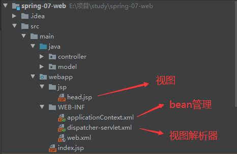

# Spring

## 1. Spring创建项目

### 1.1 创建maven项目


### 1.2 在pom中引入依赖

```xml
<dependency>
      <groupId>org.springframework</groupId>
      <artifactId>spring-context</artifactId>
      <version>5.1.5.RELEASE</version>
    </dependency>
```

## 2. spring获取bean

### 2.1 创建对象类

```java
public class HelloWorld {
    private String message;

    public String getMessage() {
        return message;
    }

    public void setMessage(String message) {
        this.message = message;
    }
}
```

### 2.2 创建bean配置文件


### 2.3 在配置文件中配置bean的属性

```xml
<?xml version="1.0" encoding="UTF-8"?>
<beans xmlns="http://www.springframework.org/schema/beans"
       xmlns:xsi="http://www.w3.org/2001/XMLSchema-instance"
       xsi:schemaLocation="http://www.springframework.org/schema/beans http://www.springframework.org/schema/beans/spring-beans.xsd">

    <!--  配置bean的属性  -->
    <bean id="helloWorld" class="org.ljq.model.HelloWorld">
        <property name="message" value="Hello World!"/>
    </bean>
</beans>
```

### 2.4 获取bean

```java
ApplicationContext factory = new FileSystemXmlApplicationContext("applicationContext.xml");
HelloWorld hello = (HelloWorld) factory.getBean("helloWorld");
```

## 3. IOC容器

### 3.1 bean与Spring容器的关系


### 3.2 配置bean的方法

1. 基于XML配置
2. 基于注解
3. 基于java的配置

### 3.3 bean的作用域

|     作用域     |                             描述                             |
| :------------: | :----------------------------------------------------------: |
|   singleton    | 在spring IoC容器仅存在一个Bean实例，Bean以单例方式存在，默认值 |
|   prototype    | 每次从容器中调用Bean时，都返回一个新的实例，即每次调用getBean()时，相当于执行newXxxBean() |
|    request     | 每次HTTP请求都会创建一个新的Bean，该作用域仅适用于WebApplicationContext环境 |
|    session     | 同一个HTTP Session共享一个Bean，不同Session使用不同的Bean，仅适用于WebApplicationContext环境 |
| global-session | 一般用于Portlet应用环境，该作用域仅适用于WebApplicationContext环境 |

```xml
<bean id="teacher" class="org.ljq.model.teacher" scope="singleton">
        <property name="name" value="laoshi"/>
        <property name="sex" value="man"/>
</bean>

<bean id="student" class="org.ljq.model.student" scope="prototype">
        <property name="name" value="ljq"/>
        <property name="sex" value="man"/>
</bean>
```

### 3.4 bean的生命周期

|      方法      |           描述           |
| :------------: | :----------------------: |
|  init-method   | 在bean被赋值后调用的方法 |
| destroy-method | 在bean被销毁后调用的方法 |

```java
public class student {
    private String name;
    private String sex;
    
    public void init(){
        System.out.println("student初始化完成");
    }

    public void destroy(){
        System.out.println("student 销毁");
    }
 }
```

```xml
    <bean id="studentInit" class="org.ljq.model.student" scope="prototype" 
          init-method="init" destroy-method="destroy">
        <property name="name" value="ljq"/>
        <property name="sex" value="man"/>
    </bean>
```

​	**经过查资料排查验证发现，对于Bean的作用域如果是多例-prototype，IOC容器并不会执行相关的清理工作，只有单例模式下才会进行Bean的销毁，因此示例代码中destroy方法根本不会被调用，多例Bean的生命周期不归IOC容器来管理，单例Bean的生命周期归IOC容器管理**

### 3.5 bean的后置处理器

Bean 后置处理器允许在调用初始化方法前后对 Bean 进行额外的处理。

**定义后置处理器**

```java
public class InitStudent implements BeanPostProcessor {
    @Override
    public Object postProcessAfterInitialization(Object bean, String beanName) throws BeansException {
        System.out.println("postProcessAfterInitialization 触发"+beanName);
        return bean;
    }

    @Override
    public Object postProcessBeforeInitialization(Object bean, String beanName) throws BeansException {
        System.out.println("postProcessBeforeInitialization 触发"+beanName);
        return bean;
    }
}
```

**注册**

```xml
<bean class="org.ljq.util.InitStudent"/>
```

### 3.6 Bean的继承

子bean可以继承父bean的一些配置属性，在xml中用parent属性继承

```xml
    <bean id="father" class="org.ljq.model.people">
        <property name="name" value="ljq"/>
        <property name="age" value="50"/>
        <property name="sex" value="man"/>
    </bean>

    <bean id="son" class="org.ljq.model.people" parent="father">
        <property name="age" value="18"/>
        <property name="name" value="son"/>
    </bean>
```

## 4. IOC控制反转

### 4.1 什么是控制反转

普通的方法

```java
public class TextEditor {
   private SpellChecker spellChecker;  
   public TextEditor() {
      spellChecker = new SpellChecker();
   }
}
```

IOC方法

```java
public class TextEditor {
   private SpellChecker spellChecker;
   public TextEditor(SpellChecker spellChecker) {
      this.spellChecker = spellChecker;
   }
}
```

IOC的方法使textEditor类不再需要去管理spellChecker的实现，spellChecker的实现交给spring框架管理，**我们也能通过setter方法注入依赖**

### 4.2 构造器注入

```xml
    <bean id="computer" class="org.ljq.model.Computer">
        <constructor-arg name="game" ref="game"/>
        <constructor-arg name="people" ref="father"/>
    </bean>
```

```java
public class Computer {
    private Game game;
    private people people;

    public Computer(Game game, people people) {
        System.out.println("Computer的构造器");
        this.game = game;
        this.people = people;
    }

    public void play(){
        this.game.play();
    }
}
```

### 4.3 setter注入

```java
public class Computer {
    private Game game;
    private people people;
    
    public void setGame(Game game) {
        this.game = game;
    }

    public void setPeople(org.ljq.model.people people) {
        this.people = people;
    }

    public void play(){
        this.game.play();
    }
}
```

```xml
    <bean id="computer" class="org.ljq.model.Computer">
        <property name="game" ref="game"/>
        <property name="people" ref="father"/>
    </bean>
```

### 4.4 命名空间的写法

```xml
<?xml version="1.0" encoding="UTF-8"?>

<beans xmlns="http://www.springframework.org/schema/beans"
    xmlns:xsi="http://www.w3.org/2001/XMLSchema-instance"
    xmlns:p="http://www.springframework.org/schema/p"
    xsi:schemaLocation="http://www.springframework.org/schema/beans
    http://www.springframework.org/schema/beans/spring-beans-3.0.xsd">

   <bean id="john-classic" class="com.example.Person"
      p:name="John Doe"
      p:spouse-ref="jane"/>
   </bean>

   <bean name="jane" class="com.example.Person"
      p:name="John Doe"/>
   </bean>

</beans>
```

### 4.5 注入集合

spring提供了4种配置元素用来注入集合（List、Set、Map、Properties）的元素

|   元素   |                            描述                             |
| :------: | :---------------------------------------------------------: |
| \<list>  |                          注入list                           |
|  \<set>  |                           注入set                           |
|  \<map>  | 它可以用来注入名称-值对的集合，其中名称和值可以是任何类型。 |
| \<props> | 它可以用来注入名称-值对的集合，其中名称和值都是字符串类型。 |

```xml
    <bean id="data" class="org.ljq.model.data">
        <property name="list">
            <list>
                <value>1</value>
                <value>2</value>
            </list>
        </property>
        <property name="map">
            <map>
                <entry key="1" value="a"/>
                <entry key="2" value="b"/>
            </map>
        </property>
        <property name="set">
            <set>
                <value>1</value>
                <value>2</value>
            </set>
        </property>
        <property name="props">
            <props>
                <prop key="1">a</prop>
                <prop key="2">b</prop>
            </props>
        </property>
    </bean>
```

## 5. 自动装配

自动装配的模式

| 模式        | 描述                                                         |
| ----------- | :----------------------------------------------------------- |
| no          | 这是默认的设置，它意味着没有自动装配，你应该使用显式的bean引用来连线。你不用为了连线做特殊的事。在依赖注入章节你已经看到这个了。 |
| byName      | 由属性名自动装配。Spring 容器看到在 XML 配置文件中 bean 的自动装配的属性设置为 byName。然后尝试匹配，并且将它的属性与在配置文件中被定义为相同名称的 beans 的属性进行连接。 |
| byType      | 由属性数据类型自动装配。Spring 容器看到在 XML 配置文件中 bean 的自动装配的属性设置为 byType。然后如果它的**类型**匹配配置文件中的一个确切的 bean 名称，它将尝试匹配和连接属性的类型。如果存在不止一个这样的 bean，则一个致命的异常将会被抛出。 |
| constructor | 类似于 byType，但该类型适用于构造函数参数类型。如果在容器中没有一个构造函数参数类型的 bean，则一个致命错误将会发生。 |
| autodetect  | Spring首先尝试通过 constructor 使用自动装配来连接，如果它不执行，Spring 尝试通过 byType 来自动装配。 |

### 5.1 byName

该模式会自动匹配与属性名相同的bean进行装配。

```xml
    <bean id="teacher" class="org.ljq.model.teacher" scope="singleton">
        <property name="name" value="laoshi"/>
        <property name="sex" value="man"/>
    </bean>

    <bean id="classRoom" class="org.ljq.model.classRoom" scope="singleton" autowire="byName">
        <property name="students">
            <list>
                <ref bean="student"/>
            </list>
        </property>
    </bean>
```

### 5.2 byType

该模式会自动匹配与属性类型相同的bean进行装配

```xml
    <bean id="teacher1" class="org.ljq.model.teacher" scope="singleton">
        <property name="name" value="laoshi"/>
        <property name="sex" value="man"/>
    </bean>

    <bean id="classRoom" class="org.ljq.model.classRoom" scope="singleton" autowire="byType">
        <property name="students">
            <list>
                <ref bean="student"/>
            </list>
        </property>
    </bean>
```

### 5.3 constructor

该模式利用构造器注入，会自动匹配与构造器中的属性类型相同的bean

```xml
    <bean id="game" class="org.ljq.model.Game">
        <constructor-arg name="name" value="lushi"/>
    </bean>

    <bean id="computer" class="org.ljq.model.Computer" autowire="constructor">
        <constructor-arg name="people" ref="father"/>
    </bean>
```

## 6. 基于注解开发

要使用注解开发，必须在配置里开启

```xml
<?xml version="1.0" encoding="UTF-8"?>

<beans xmlns="http://www.springframework.org/schema/beans"
       xmlns:xsi="http://www.w3.org/2001/XMLSchema-instance"
       xmlns:context="http://www.springframework.org/schema/context"
       xsi:schemaLocation="http://www.springframework.org/schema/beans
    http://www.springframework.org/schema/beans/spring-beans-3.0.xsd
    http://www.springframework.org/schema/context
    http://www.springframework.org/schema/context/spring-context-3.0.xsd">

    <context:annotation-config/>
    <!-- bean definitions go here -->

</beans>
```

| 注解                                                         | 描述                                                         |
| ------------------------------------------------------------ | ------------------------------------------------------------ |
| @Required                                                    | @Required 注解应用于 bean 属性的 setter 方法。               |
| @Autowired                                                   | @Autowired 注解可以应用到 bean 属性的 setter 方法，非 setter 方法，构造函数和属性。 |
| @Qualifier                                                   | 通过指定确切的将被连线的 bean，@Autowired 和 @Qualifier 注解可以用来删除混乱。 |
| [ JSR-250 Annotations](https://www.w3cschool.cn/wkspring/lmsq1mm4.html) | @Resource，@PostConstruct 和 @PreDestroy                     |

### 6.1 @Required

用于标注setter方法，注释的setter方法对应的属性必须在配置文件中配置，否则会报错。

```java
public class student {
    private String name;
    private String age;

    @Required
    public void setName(String name) {
        this.name = name;
    }

    @Required
    public void setAge(String age) {
        this.age = age;
    }
}
```

### 6.2 @Autowired

根据type自动装配，可以用在setter，非setter方法，构造函数和属性。

注：**通过new出来的对象不能@Autowired注释的属性**，因为new出的对象不受spring框架的管理，要使用bean必须通过getBean。**要使用@Autowired注释的属性或对象，必须在spring框架下运行程序**

#### **Spring测试方法**

```java
@ContextConfiguration(locations = "file:E:\\项目\\study\\spring-02\\src\\main\\resources\\ApplicationConfigure.xml")
@RunWith(SpringJUnit4ClassRunner.class)
public class AppTest 
{
    @Autowired
    private teacher teacher;

    @Test
    public void shouldAnswerWithTrue()
    {
        teacher.say();
        assertTrue( true );
    }
}
```

**类的定义**

```java
@Component
public class teacher {
    public void say(){
        System.out.println("成功");
    }
}
```

**xml文件配置自动扫描**

```xml
<context:component-scan base-package="org.ljq.Dao"/>
```

### 6.3 @Qualifier

当有多个相同类型的bean的时候，可以通过@Qualifier指定一个bean进行装配

```java
    @Qualifier("student2")
    @Autowired
    private student student;
```

### 6.4 JSR-250注释

@PostConstruct 用于指定某个方法为init-method

@PreDestroy 用于指定某个发给发为destroy-method

```java
    @PostConstruct
    public void init(){
        System.out.println("初始化");
    }
    @PreDestroy
    public void destroy(){
        System.out.println("销毁");
    }
```

@Resource 为属性或者setter方法使用bean的name匹配bean

```java
    @Resource(name = "student2")
    public void setStudent(student student) {
        this.student = student;
    }
```

### 6.5 基于java的配置开发

@Configuration指定类为spring配置类

@Bean指定方法返回的对象会被注册为一个bean

```java
@Configuration
public class Config {
    @Bean(initMethod = "init",destroyMethod = "destroy")
    @Scope("singleton")
    public student student(){
        student student = new student();
        student.setName("ljq");
        student.setAge("18");
        return student;
    }
    @Bean
    public school school(){
        school school = new school();
        school.setName("whut");
        school.setStudent(student());
        return school;
    }
}
```

**测试类**

```java
@ContextConfiguration(classes = Config.class)
@RunWith(SpringJUnit4ClassRunner.class)
public class AppTest 
{
    @Autowired
    private student student;

    @Test
    public void shouldAnswerWithTrue()
    {
        System.out.println(student);
        assertTrue( true );
    }
}
```

@Import注解允许从另一个配置类中加载bean的定义

@Scope指定范围，默认是单例模式

### 6.6 spring事件处理

| 事件                  | 描述                                                         |
| --------------------- | ------------------------------------------------------------ |
| ContextRefreshedEvent | ApplicationContext 被初始化或刷新时，该事件被发布。或通过refresh()方法 |
| ContextStartedEvent   | 当使用 ConfigurableApplicationContext 接口中的 start() 方法启动 ApplicationContext 时，该事件被发布 |
| ContextStoppedEvent   | 当使用 ConfigurableApplicationContext 接口中的 stop() 方法停止 ApplicationContext 时，发布这个事件 |
| ContextClosedEvent    | 当使用 ConfigurableApplicationContext 接口中的 close() 方法关闭 ApplicationContext 时，该事件被发布 |
| RequestHandledEvent   | 这是一个 web-specific 事件，告诉所有 bean HTTP 请求已经被服务 |

```java
public class CStartEventHandler implements ApplicationListener<ContextStartedEvent> {
    @Override
    public void onApplicationEvent(ContextStartedEvent contextStartedEvent) {
        System.out.println("ContextStartedEvent Received");
    }
}
```

```xml
<bean id="cStartEventHandler" class="org.ljq.util.CStartEventHandler"/>
```

### 6.7 Spring自定义事件

定义事件，继承ApplicationEvent的方法

```java
public class CustomEvent extends ApplicationEvent {
    public CustomEvent(Object source){
        super(source);
    }

    public String toString(){
        return "My Custom Event";
    }
}
```

定义事件的发布器

```java
public class CustomEventPublisher implements ApplicationEventPublisherAware {
    private ApplicationEventPublisher publisher;
    @Override
    public void setApplicationEventPublisher(ApplicationEventPublisher publisher) {
        this.publisher = publisher;
    }
    public void publish(){
        CustomEvent ce = new CustomEvent(this);
        publisher.publishEvent(ce);
    }
}
```

定义handler

```java
public class CustomEventHandler implements ApplicationListener<CustomEvent>{
    public void onApplicationEvent(CustomEvent event) {
        System.out.println(event.toString());
    }
}
```

配置bean

```xml
<bean id="customEventHandler" class="org.ljq.util.CustomEventHandler"/>
<bean id="customEventPublisher" class="org.ljq.util.CustomEventPublisher"/>
```

调用事件

```java
public static void main( String[] args ){
        ConfigurableApplicationContext context = new FileSystemXmlApplicationContext("ApplicationConfigure.xml");
        CustomEventPublisher cvp = (CustomEventPublisher) context.getBean("customEventPublisher");
        cvp.publish();
}
```

## 7. Spring的AOP

### 7.1 什么是AOP

AOP就是面向切面的编程。AOP通过引入横切关注点实现一些功能的解耦，产生类似单片机里中断的作用。

**术语**

| 术语          | 描述                                                         |
| ------------- | ------------------------------------------------------------ |
| Aspect        | 一个模块具有一组提供横切需求的 APIs。例如，一个日志模块为了记录日志将被 AOP 方面调用。应用程序可以拥有任意数量的方面，这取决于需求。 |
| Join point    | 在你的应用程序中它代表一个点，你可以在插件 AOP 方面。你也能说，它是在实际的应用程序中，其中一个操作将使用 Spring AOP 框架。 |
| Advice        | 这是实际行动之前或之后执行的方法。这是在程序执行期间通过 Spring AOP 框架实际被调用的代码。 |
| Pointcut      | 这是一组一个或多个连接点，通知应该被执行。你可以使用表达式或模式指定切入点正如我们将在 AOP 的例子中看到的。 |
| Introduction  | 引用允许你添加新方法或属性到现有的类中。                     |
| Target object | 被一个或者多个方面所通知的对象，这个对象永远是一个被代理对象。也称为被通知对象。 |
| Weaving       | Weaving 把方面连接到其它的应用程序类型或者对象上，并创建一个被通知的对象。这些可以在编译时，类加载时和运行时完成。 |

**通知**

| 通知类型       | 描述                                                         |
| -------------- | ------------------------------------------------------------ |
| 前置通知       | 在一个方法执行之前，执行通知。                               |
| 后置通知       | 在一个方法执行之后，不考虑其结果，执行通知。                 |
| 返回后通知     | 在一个方法执行之后，只有在方法成功完成时，才能执行通知。     |
| 抛出异常后通知 | 在一个方法执行之后，只有在方法退出抛出异常时，才能执行通知。 |
| 环绕通知       | 在建议方法调用之前和之后，执行通知。                         |

**实现自定义方面**

| 方法                                                         | 描述                                                         |
| ------------------------------------------------------------ | ------------------------------------------------------------ |
| [XML Schema based](https://www.w3cschool.cn/wkspring/omps1mm6.html) | 方面是使用常规类以及基于配置的 XML 来实现的。                |
| [@AspectJ based](https://www.w3cschool.cn/wkspring/k4q21mm8.html) | @AspectJ 引用一种声明方面的风格作为带有 Java 5 注释的常规 Java 类注释。 |

### 7.2 基于AOP的XML架构

首先引入maven依赖

- aspectjrt.jar
- aspectjweaver.jar
- aspectj.jar
- aopalliance.jar

```xml
<dependency>
    <groupId>org.aspectj</groupId>
    <artifactId>aspectjrt</artifactId>
    <version>1.8.9</version>
</dependency>
<dependency>
    <groupId>org.aspectj</groupId>
    <artifactId>aspectjweaver</artifactId>
    <version>1.8.9</version>
</dependency>
<dependency>
    <groupId>aopalliance</groupId>
    <artifactId>aopalliance</artifactId>
    <version>1.0</version>
</dependency>
<dependency>
    <groupId>org.aspectj</groupId>
    <artifactId>aspectjtools</artifactId>
    <version>1.8.9</version>
</dependency>
```

配置spring配置文件

```xml
<?xml version="1.0" encoding="UTF-8"?>
<beans xmlns="http://www.springframework.org/schema/beans"
       xmlns:xsi="http://www.w3.org/2001/XMLSchema-instance"
       xmlns:aop="http://www.springframework.org/schema/aop"
       xsi:schemaLocation="http://www.springframework.org/schema/beans
       http://www.springframework.org/schema/beans/spring-beans.xsd
       http://www.springframework.org/schema/aop
       http://www.springframework.org/schema/aop/spring-aop-4.0.xsd">
```

单独写一个aop类

```java
public class aop {
    public void startup(){
        System.out.println("开机");
    }

    public void shutdown(){
        System.out.println("关机");
    }
}
```

配置切面

```xml
<bean id="aop" class="util.aop"/>

<aop:config>
    <!-- 申明切面引用类 -->
    <aop:aspect id="aopAspect" ref="aop">
        <!--  指定切入点  -->
        <aop:pointcut id="StartService" expression="execution(* model.Computer.play())"/>
        <!-- 指定切入方法 -->
        <aop:before pointcut-ref="StartService" method="startup"/>
        <aop:after pointcut-ref="StartService" method="shutdown"/>
    </aop:aspect>
</aop:config>
```

### 7.3 基于注解的AOP

首先在xml配置中把AOP注解配置打开

```xml
<aop:aspectj-autoproxy/>
```

用注解写一个AOP类

```java
@Aspect
public class aop {
    @Pointcut("execution(* model.Computer.play())")
    private void play(){}

    @Before("play()")
    public void startup(){
        System.out.println("开机");
    }

    @After("play()")
    public void shutdown(){
        System.out.println("关机");
    }
}
```

```xml
<bean id="aop" class="util.aop"/>
```

## 8. Spring JDBC框架

## 9. Spring MVC web

### 9.1 web项目基本结构



### 9.2 dispatcher-servlet基本配置

```xml
<?xml version="1.0" encoding="UTF-8"?>
<beans xmlns="http://www.springframework.org/schema/beans"
       xmlns:xsi="http://www.w3.org/2001/XMLSchema-instance"
       xmlns:context="http://www.springframework.org/schema/context"
       xmlns:mvc="http://www.springframework.org/schema/mvc"
       xsi:schemaLocation="http://www.springframework.org/schema/beans
       http://www.springframework.org/schema/beans/spring-beans.xsd
       http://www.springframework.org/schema/context
       http://www.springframework.org/schema/context/spring-context.xsd
       http://www.springframework.org/schema/mvc
       http://www.springframework.org/schema/mvc/spring-mvc.xsd">
    
    <mvc:default-servlet-handler/>
    <mvc:annotation-driven/>
   	<!-- 指定控制器 -->
    <context:component-scan base-package="controller"/>
    
</beans>
```

### 9.3 控制器配置

```java
@RestController
@RequestMapping("/views")
public class MyController {
    @Autowired
    private student student;
    @RequestMapping(value = "/show",method = RequestMethod.POST)
    public String show(){
        System.out.println("接口测试成功");
        return student.getName();
    }
}
```

**@RestController**：申明当前类为控制器的同时，指定接口返回普通数据。否则接口返回跳转路径

**@ResponseBody**：指定接口返回普通数据。作用于接口